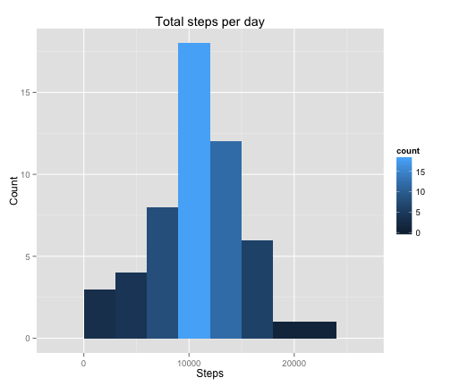
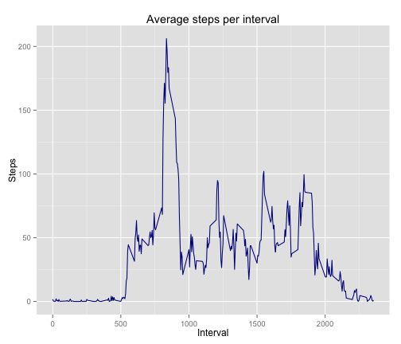
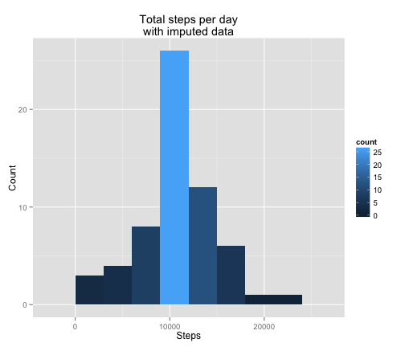
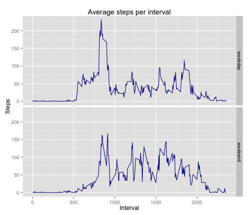

Reproducible Research: Peer Assessment 1
========================================================

This assignment makes use of data from a personal activity monitoring device. This device collects data at 5 minute intervals through out the day. The data consists of two months of data from an anonymous individual collected during the months of October and November, 2012 and include the number of steps taken in 5 minute intervals each day.  The questions
and answers for this assignment are listed below.  Additionally, code and figures are
included in the document.

### Loading and preprocessing the data
The initial step for the project was to load the step data (figure 1).

```r
library(ggplot2)
library(dplyr)
steps<-read.csv("activity.csv",header=TRUE,sep=",")
steps$date<-as.Date(steps$date)
```
figure 1.  
<br/>
<br/>
<br/>
### What is mean total number of steps taken per day?
In order to determine the mean and total number of steps taken per day the daily step data was first grouped by date and then summarized using the sum function (figure 2).  

```r
steps2<-
    steps%>%
    group_by(date)%>%
    summarize(daily_step = sum(steps))
```
figure 2.   
<br/>
<br/>


The mean and median steps were calculated as 
**10766** and 
**10765** 
respectively.  The code for mean and median cacluations are shown in figure 3.  A histogram of the total number of steps per day was plotted to examine the distribution
of steps (figure 4).
<br/>
<br/>

```r
mean<-as.numeric(summarize(steps2,mean(daily_step,na.rm=TRUE)))
median<-as.numeric(summarize(steps2,median(daily_step,na.rm=TRUE)))
```
figure 3.
<br/>
<br/>

```r
g<-ggplot(steps2,aes(x=daily_step))
g+geom_histogram(aes(fill = ..count..),binwidth=3000)+labs(x="Steps",y="Count",
                                                    title="Total steps per day")
```

 

figure 4.  
<br/>
<br/>
<br/>
### What is the average daily activity pattern?
A time series plot of the 5-minute interval (x-axis) and the average number of steps taken, averaged across all days (y-axis) was examined.  First, the data was grouped by the interval variable then the mean of the daily steps was calculated shown in figure 5.  

```r
steps3<-
    steps%>%
    group_by(interval)%>%
    summarize(interval_step = mean(steps,na.rm=TRUE))
```
figure 5.
<br/>
<br/>
<br/>


Next, the average steps per interval was plotted on a time series graph (figure 6) which indicates that the 
**835** 
interval had the maximum average daily steps.


```r
g<-ggplot(steps3,aes(interval,interval_step))
g+geom_line(color="darkblue")+
    labs(x="Interval",y="Steps", title="Average steps per interval")
```

 

figure 6.  
<br/>
<br/>
<br/>
### Imputing missing values

The original dataset, steps, contains missing steps for a number of observations.  Specifically,
**2304**
rows of step data was missing, calculated with the code in figure 7.

```r
miss_step<-filter(steps,is.na(steps))
count_na_step<-nrow(miss_step) 
```
figure 7. 
<br/>
<br/>
<br/>
In order to compensate for incomplete observations, the missing step data was replaced with the average daily step for each corresponding interval.  The missing dataset, miss_step, was merged with the steps3 transformed dataset (figure 3) to accomplish this.  The code for the merge is shown in figure 8.

```r
new_miss<-merge(miss_step,steps3,by="interval")
new_miss<-select(new_miss,as.integer(interval_step),date,interval)
new_miss<-rename(new_miss,steps=interval_step)
new_miss<-mutate(new_miss,steps=as.integer(steps))
```
figure 8.
<br/>
<br/>
<br/>
The missing steps observations were removed from the original dataset, steps, and was
subsequently row bound with the new_miss dataset (figure 9).

```r
steps4<-filter(steps,! is.na(steps))
steps5<-rbind(new_miss,steps4)
```
figure 9.
<br/>
<br/>
<br/>

The non missing value dataset was grouped by date and the daily steps were summarized (figure 10).
A histogram was constructed using the dataset with non missing summarized values, steps6 (figure 11).  The new mean and medain were 
**10749** and
**10641** respectively.  The non missing value mean and median are 17 and 24 steps less than the original steps dataset mean and median.  The shift of the mean and median to the left for the non missing value dataset indicates that majority of the missing data occured for intervals with lower than the original mean of 10766 steps.

```r
steps6<-
    steps5%>%
    group_by(date)%>%
    summarize(daily_step = sum(steps))
```
figure 10.
<br/>
<br/>
<br/>

```r
g<-ggplot(steps6,aes(x=daily_step))
g+geom_histogram(aes(fill = ..count..),binwidth=3000)+labs(x="Steps",y="Count",
                    title="Total steps per day\nwith imputed data")
```

 

figure 11.  
<br/>
<br/>
<br/>
### Are there differences in activity patterns between weekdays and weekends?
Finally, the difference in activity between weekdays and weekends was investigated.  This was accomplished by first creating a new dataset that contains a factor variable, week, with two levels – “weekday” and “weekend” indicating whether a given date is a weekday or weekend day.  The code to produce the dataset is shown in figure 12.

```r
steps7<-mutate(steps5,"weekday" = weekdays(as.Date(date)))
weekend<-filter(steps7,weekday=="Saturday" | weekday=="Sunday")
weekend$week="weekend"
weekday<-filter(steps7,weekday!="Saturday" & weekday!="Sunday")
weekday$week="weekday"
steps8<-rbind(weekday,weekend)
```
figure 12.
<br/>
<br/>
<br/>
A panel plot was constructed containing a time series plot of the 5-minute interval and the average number of steps taken, averaged across all weekday days or weekend days (figure 13).  This plot shows the difference in activity across intervals for the weekend versus the weekday.  In general activity seems to be greater on the weekend for intervals 1000 to 1750.

```r
steps9<-
    steps8%>%
    group_by(interval,week)%>%
    summarize(mean_step = mean(steps))
```

```r
g<-ggplot(steps9,aes(interval,mean_step))
g+geom_line(color="darkblue")+facet_grid(week~.)+labs(x="Interval",y="Steps",title=
                "Average steps per interval")
```

 

figure 13.

